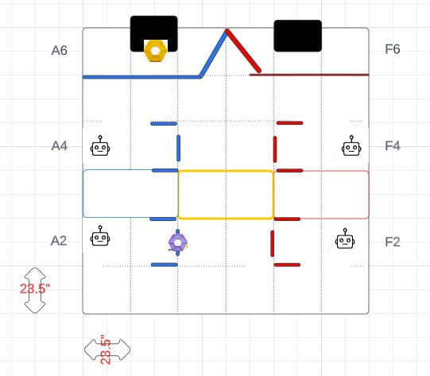

#### Goal --> Starting from each possible start positions (A2, A4, F2, F4), list exact steps to place the purple pixel on center stripe, move to backboard and place yellow stripe and then park Kermit. 

* Steps for A2 and F2 should be similar except for the change in direction (left vs right move after placing the purple pixel)

* For now, assume that purple pixel has to be placed on center stripes. We will add the cases of it being on left or right stripes later.

* For now, assume that bot arm has a reach of 10 inches from its front edge, while placing the pixel on stripe or on board. We will change that once we have tested the final robot design.

* Notice that when moving after placing the purple pixel on the stripe, we have to make sure that we do not knock out the white or purple pixel when moving to back-board. You have to back out of the stripe boundaries, not drive through.

* We will try to avoid colliding with the alliance bot. When starting from A2 or F2, take the truss route and park on right side of board. When starting from A4 or F4, take the direct route and park on left side of board.

* Please draw multiple routes on a paper. The drawing on the paper is only for illustration and does not have to be perfect. Even calculations do not have to be perfect, but those should allow margin of error. We do not want to hit the wingnut on the inside of the stage door. 

* **Please see this image for measurements and layout**

  

* Above image has been drawn [here](https://lucid.app/lucidchart/acd9e956-cdda-4175-85a8-a38ebbc6fadf/edit?invitationId=inv_7c0f06b6-3481-433a-99ce-fb8818bab92f). 
  

